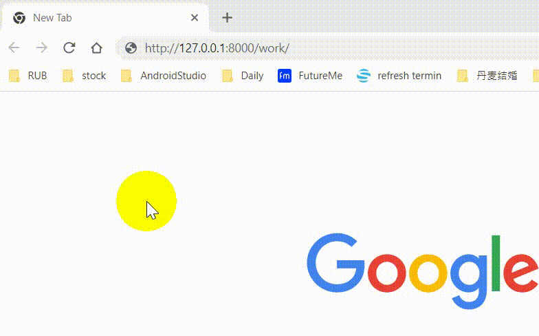
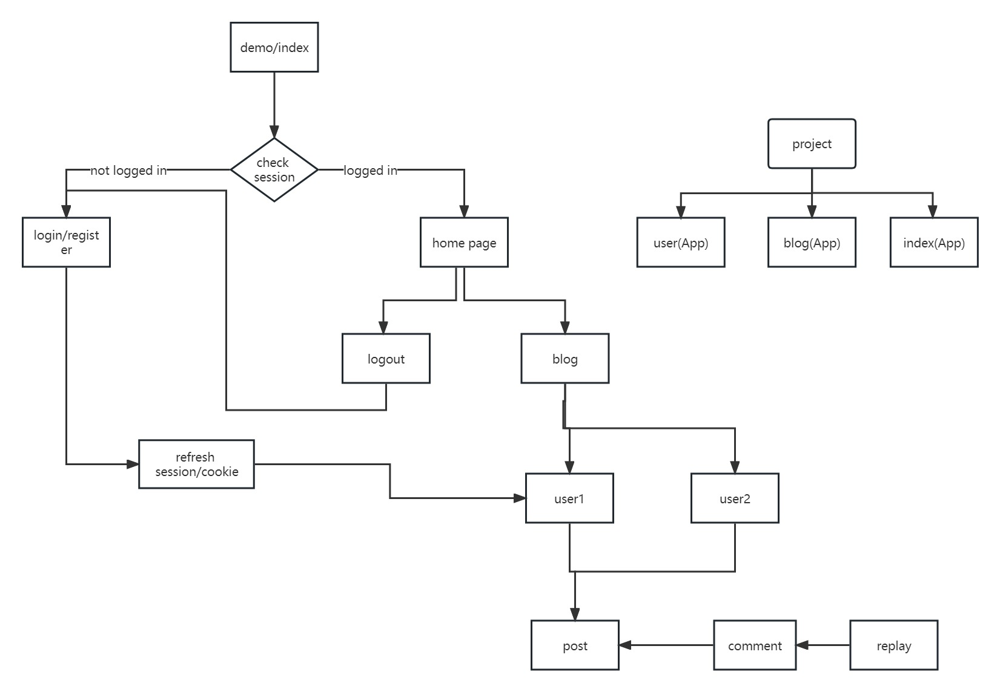

# demo python task
#### BASE_DIR: ./django_projects/01_demoProject/work

## sum of a list & fibonacci

# demo project
#### BASE_DIR: ./django_projects/01_demoProject

### 00-project flow

### 01-without login, the user can't visit http://127.0.0.1:8000/demo/blog/posts

### 02-post , comment , reply with user info

### 03-VPS linux server, mysql 

